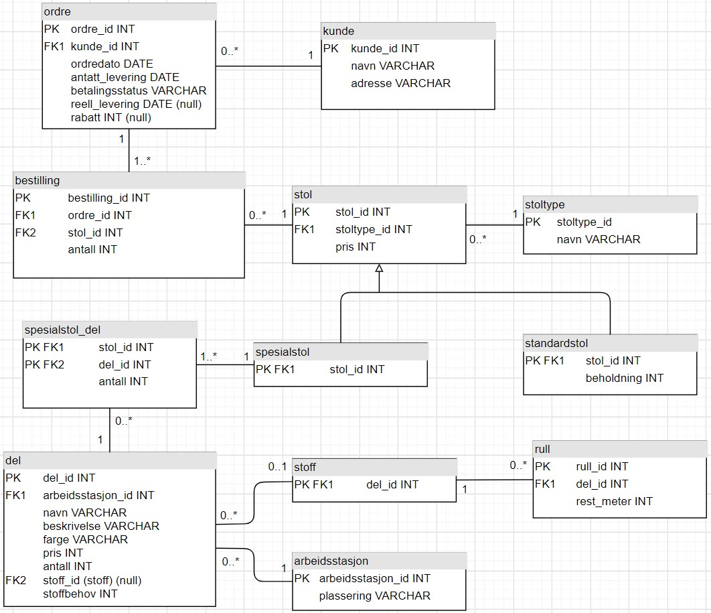

# Øving 7 - EER-modellering med SQL

## Oppgave 1 - EER
_Lag datamodell (EER) for problemstillingen. Bruk UML-notasjon._



_Oversett datamodellen til relasjonsmodellen. Strek under primærnøkler og marker fremmednøkler med stjerne._

- **kunde**(<u>kunde_id</u>, navn, adresse) 
- **ordre**(<u>ordre_id</u>, kunde_id*, ordredato, antatt_levering, betalingsstatus, reell_levering, rabatt)
- **bestilling**(<u>bestilling_id</u>, ordre_id*, stol_id*, antall)
- **stol**(<u>stol_id</u>, stoltype_id*, pris)
- **stoltype**(<u>stoltype_id</u>, navn)
- **standardstol**(<u>stol_id*</u>, beholdning)
- **spesialstol**(<u>stol_id*</u>)
- **spesialstol_del**(<u>stol_id*, del_id*</u>, antall)
- **del**(<u>del_id</u>, arbeidsstasjon_id*, navn, beskrivelse, farge, pris, antall, stoff_id*, stoffbehov)
- **arbeidsstasjon**(<u>arbeidsstasjon_id</u>, plassering)
- **stoff**(<u>del_id*</u>)
- **rull**(<u>rull_id</u>, del_id*, rest_meter)

___

## Oppgave 2 - SQL
_Sett opp SELECT-setningen som besvarer spørsmålene nedenfor. Vi begrenser oss til spørringer knyttet til ordre/bestillinger, stoler og stoltype._

1. Finn hvor mange (antallet) stolmodeller som finnes av hver stoltype.
   ```sql
   SELECT navn, COUNT(*) as "Antall modeller"
    FROM stoltype t
    LEFT JOIN stol s ON s.stoltype_id = t.stoltype_id;
   ```

2. Ut fra alle registrerte ordre (bestillinger): Finn gjennomsnittlig antall bestilte stoler av hver stoltype.
   ```sql
   SELECT navn, AVG(b.antall) AS "Snitt modeller"
    FROM stoltype t
    LEFT JOIN stol s ON s.stoltype_id = t.stoltype_id
    JOIN bestilling b ON s.stol_id = b.stol_id
    GROUP BY t.navn;
   ```
   
3. Finn det totale antallet stoler som finnes i bestilling, og som enda ikke er levert kunder. Tips: Sjekk på reell leveringsdato (dvs. om ordren er effektuert).
   ```sql
   SELECT sum(b.antall)
    FROM bestilling b
    JOIN ordre o ON b.ordre_id = o.ordre_id AND o.reell_levering IS NULL;
   ```
   
4. Finn ut hvor mange (antallet) av stolene i spørring 3 over som er standardstoler.
   ```sql
   SELECT sum(b.antall)
    FROM bestilling b
    JOIN standardstol s ON b.stol_id = s.stol_id
    JOIN ordre o ON b.ordre_id = o.ordre_id AND o.reell_levering IS NULL;
   ```
   