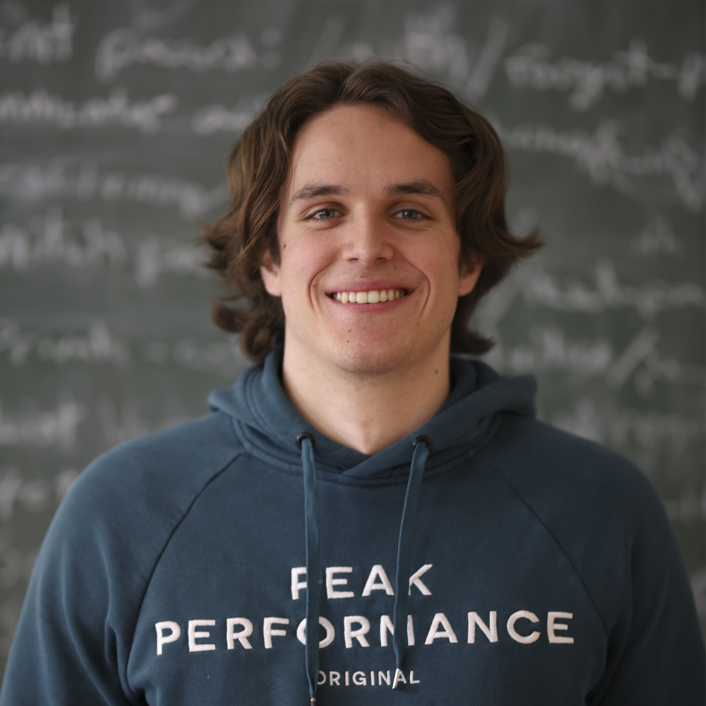
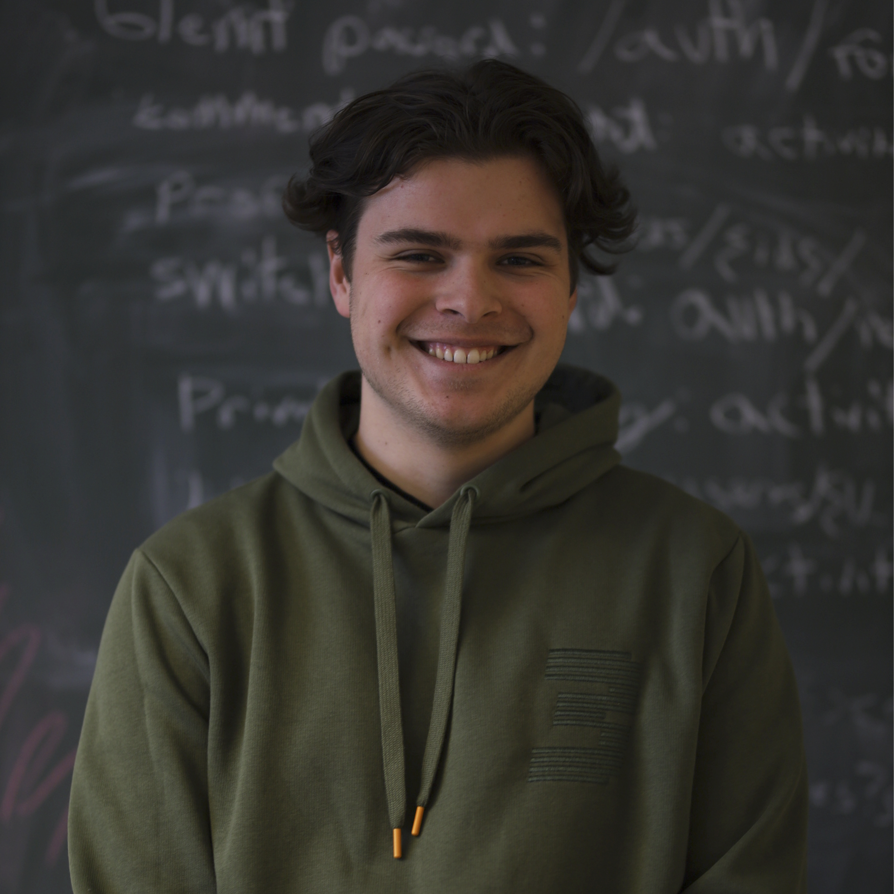
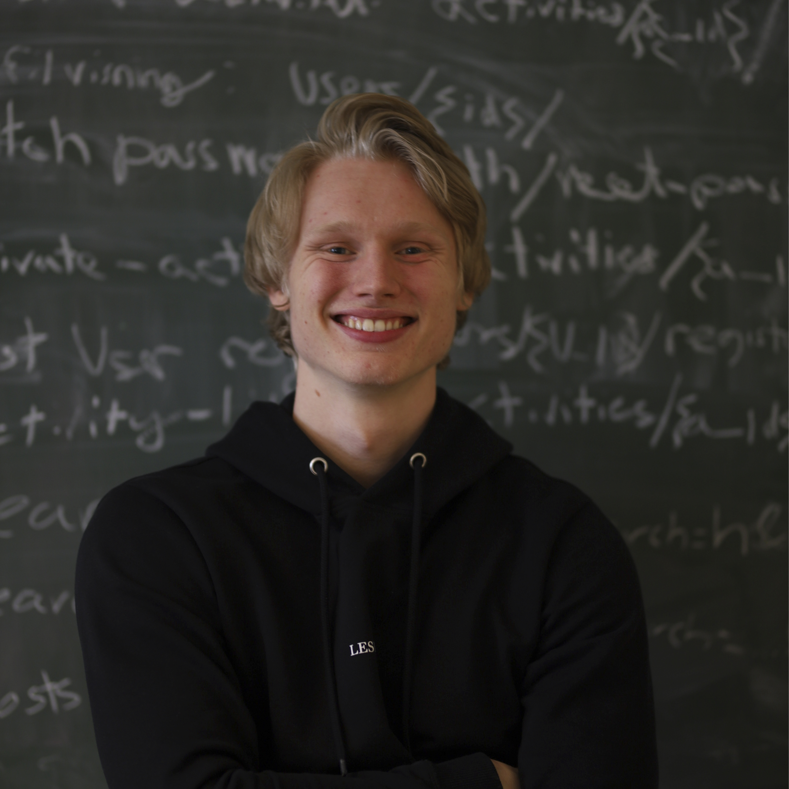
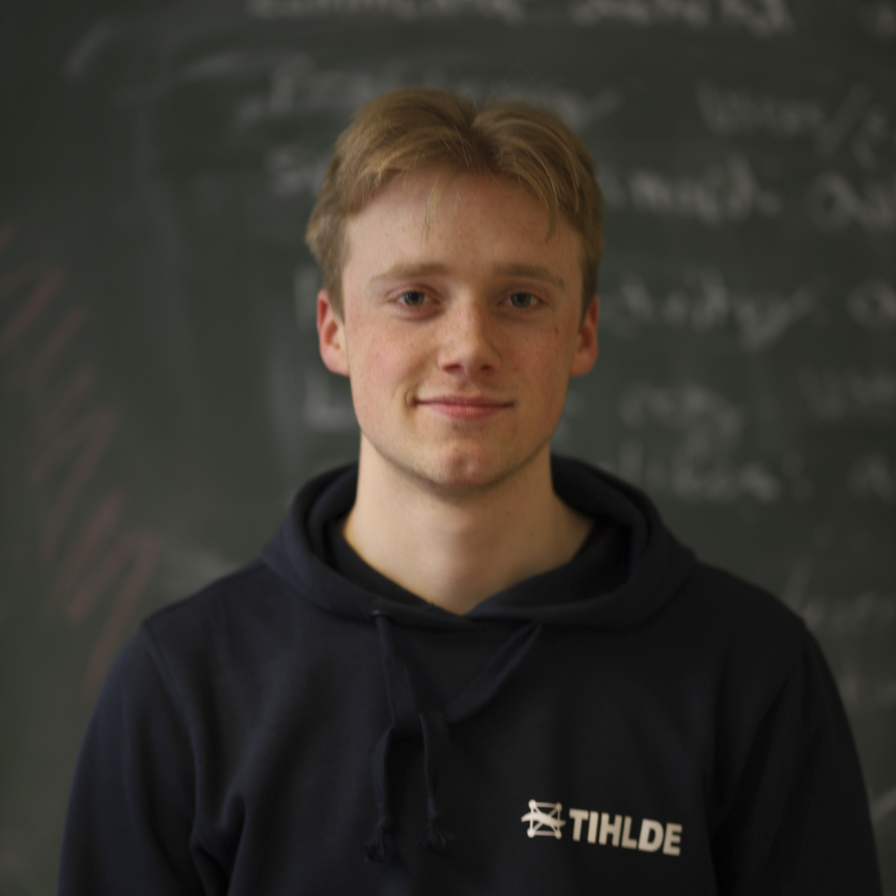
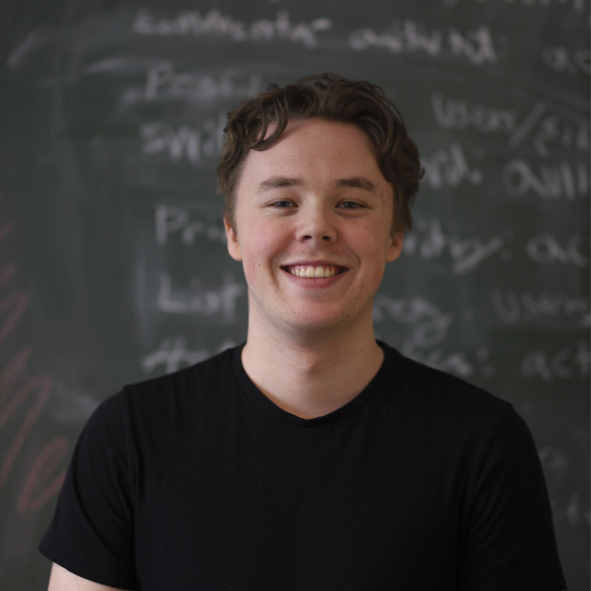
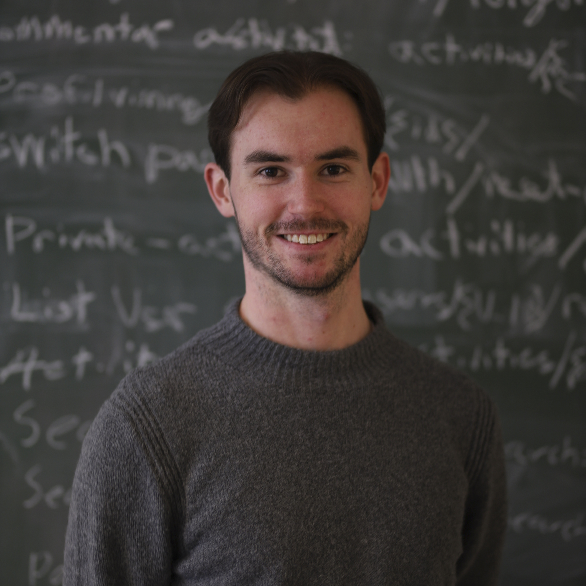
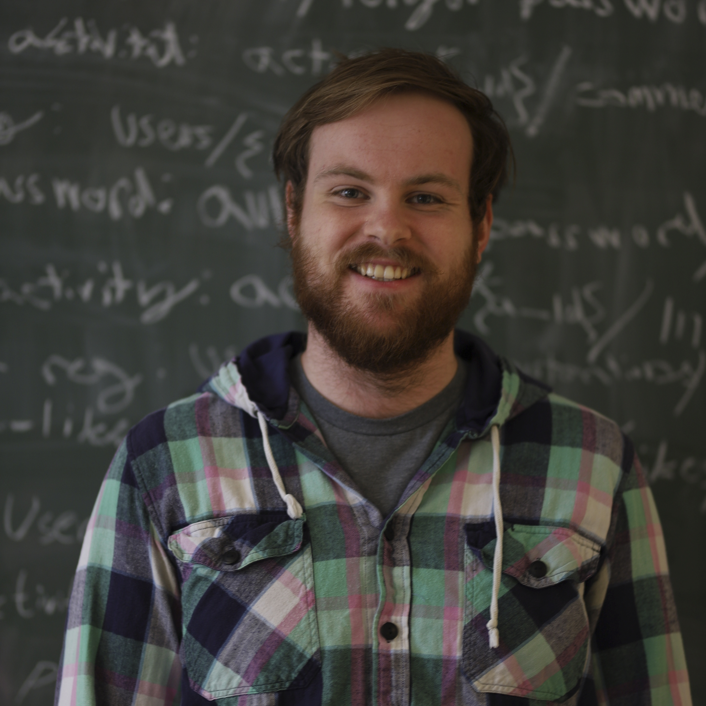

# GIDD  


GIDD er en applikasjon for å hjelpe mennesker å finne aktiviteter og sosiale samkomster i sitt nærområde.
GIDD skal være et gratis alternativ for for alle, uavhengig av treningsnivå. Enten man ønsker en rolig rusletur i skogen eller hardoppkjør til Birken skal Gidd! hjelpe brukeren finne likesinnede i sitt nærområde.

GIDD. Det er bare å gidde.

## Krav for å kjøre applikasjonen
### Backend
- [Maven](https://maven.apache.org/download.cgi)
- [Docker](https://docs.docker.com/get-docker/)
- [Make](https://www.gnu.org/software/make/) (Valgfri)

### Frontend
- [Yarn](https://classic.yarnpkg.com/en/docs/install/#debian-stable):
```bash
npm install -g yarn
```

## Installasjon

### Backend

```bash
git clone https://gitlab.stud.idi.ntnu.no/team-2-sysutv/idatt2106_2021_2.git

cd idatt2106_2021_2/backend

# Run the app without GNU Make

# With Maven  
#port 3306, 8080, and 8000 needs to be open for this to work
docker-compose up & mvn dependency:resolve && mvn spring-boot:run

# With Docker-compose
docker-compose -f docker-compose.azure.yml build
docker-compose -f docker-compose.azure.yml up

# Run the app with GNU Make

make run 

```

### Frontend

```bash
git clone https://gitlab.stud.idi.ntnu.no/team-2-sysutv/idatt2106_2021_2.git

cd idatt2106_2021_2/frontend

# Set url to api in env-file
echo REACT_APP_API_URL=http://localhost:8080/api/  > .env

# Install dependencies
yarn 

# Run the app
yarn start
```


## Trenger du hjelp?
Dersom du har spørsmål eller trenger hjelp anbefaler vi å sjekke ut vår wiki.

*[Wikien kan finnes her:](https://gitlab.stud.idi.ntnu.no/team-2-sysutv/idatt2106_2021_2/-/wikis/home)*


## Medlemmer


**Hermann Owren Elton -**



**Simon Jensen -**



**Mads Lundegaard -**



**Stian Mogen -**



**Olaf Rosendahl -**



**Nicolay Schiøll-Johansen -**



**Eirik Steira -**



**Lars Brodin Østby -**


<br/>

<p align="CENTER">
<a href="https://gitlab.stud.idi.ntnu.no/team-2-sysutv/idatt2106_2021_2/-/blob/master/LICENSE"></a>
</p>

<br/>
