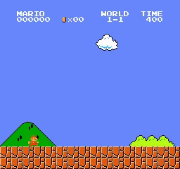

# Prosjekt i IDATT2502 - Anvendt maskinlæring med prosjekt

## Hva

Dette er et prosjekt i faget "IDATT2502 - Anvendt maskinlæring med prosjekt" der vi har sammenlignet flere forskjellige Reinforcement Learning-algoritmer for å se hvilken av dem som raskest kan trenes til å gjentagende og stabilt vinne Super Mario Bros. Algoritmene vi har sammenlignet er DQN (Deep Q-Learning), Double DQN og PPO (Proximal Policy Optimalization).

## Hvordan kjøre

For å kjøre koden trenger du først å installere pakkene som er listet i requirements.txt:

```
pip install -r requirements.txt
```

Så kan du åpne `main.py` og kjøre enten "DQN_RUN" eller "PPO_Run". I "DQN_RUN" kan du også bruke parameteret "double" for å bestemme om det skal kjøres DQN eller Double DQN (standard). 

## WandB

[WandB](https://wandb.ai/) blir brukt for å logge data fra kjøringer sammen med video av de beste kjøringene. For at en kjøring skal logges må du sende med et `wandb_name` i run-funksjonene. I tillegg er du nødt til å logge inn på WandB først. Det gjør du med `wandb login`.

Hvis du ikke vil logge med WandB så kan du la være å fylle ut `wandb_name` i run-funksjonene. For at du da evt skal kunne se noe av kjøringene så må du selv legge til `env.render()` der du ønsker å se tilstanden til spillet, dette vil normalt være der vi har skrevet `frames.append(env.frame)`.

Eksempel på seier:


