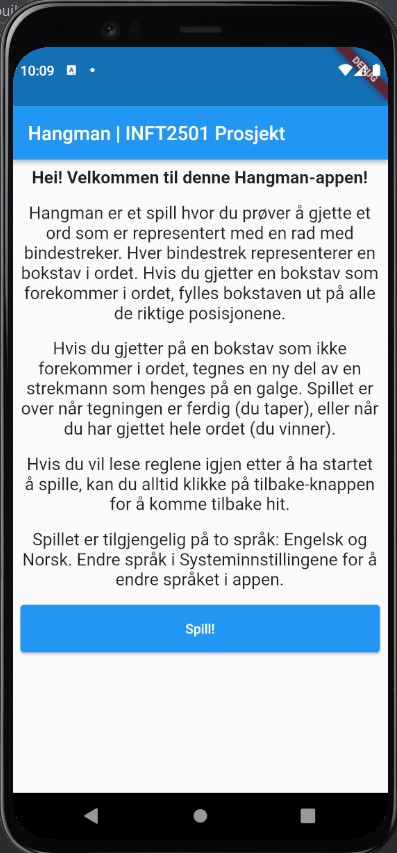
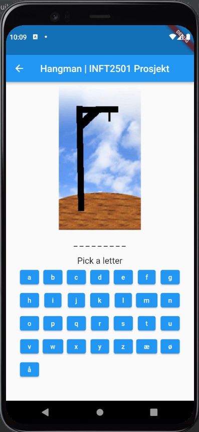
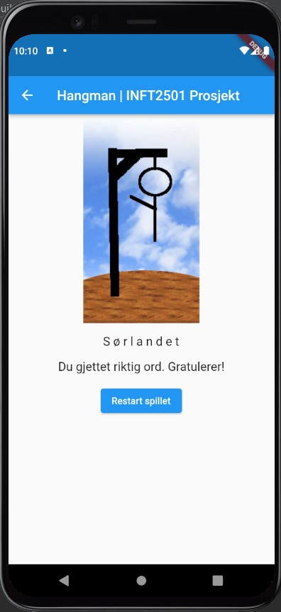
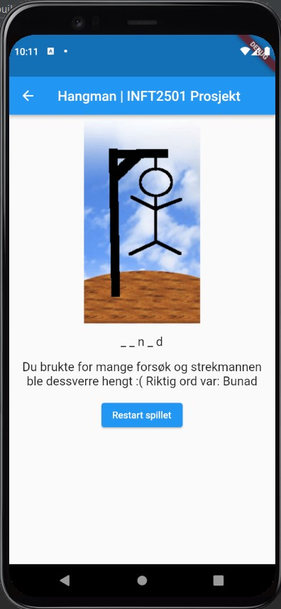

# INFT2501 Project | Hangman

## Run app in Android Emulator

1. Make sure that Flutter SDK is installed on your computer (https://flutter.dev/docs/get-started/install)
2. Open the project in Android Studio
3. Install the Flutter and Dart plugins (https://flutter.dev/docs/get-started/editor?tab=androidstudio)
4. Locate the main Android Studio toolbar:
    
5. In the **target selector**, select an Android device for running the app. If none are listed as available, select **Tools > AVD Manager** and create one there.
6. Click the run icon in the toolbar, or invoke the menu item **Run > Run**.

## Screenshots

**Info screen:**

**Game screen:**

**Victory screen:**

**Loss screen:**

